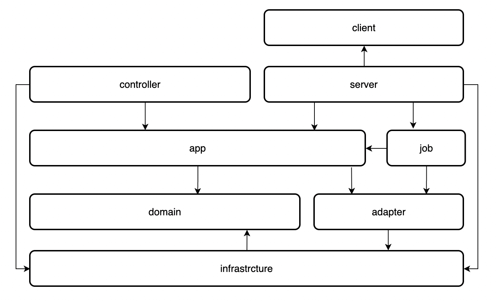

# Quick Start

```bash
# make sure there's setting.xml file in dir ~/.m2/ 
mvn archetype:create-from-project

cd target/generated-sources/archetype
mvn install

mvn archetype:crawl

# go to your project dir
mvn archetype:generate -DarchetypeCatalog=local
```

# Layers

